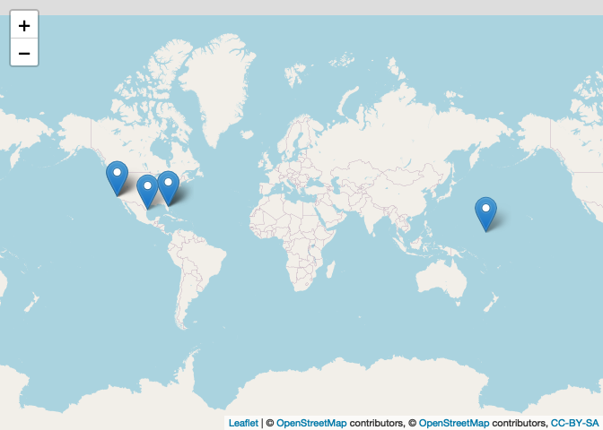

<!-- README.md is generated from README.Rmd. Please edit that file -->

# SpaceX - An R API wrapper for the SpaceX project

[](http://www.repostatus.org/#active)

## Installation

Until now the package is not on CRAN but you can download it via GitHub
with the following command:

``` r
if (!require("devtools"))
  install.packages("devtools")
devtools::install_github("JohannesFriedrich/SpaceX")
```

## Introduction

The **R**-package *SpaceX* is an API wrapper for data collected by
<https://api.spacexdata.com/v3/> (version v3). You can request available
data with different
functions:

| Function name             | Description                            | Example                                            |
| ------------------------- | -------------------------------------- | -------------------------------------------------- |
| get\_SpaceX\_capsules()   | request information on capsules        | get\_SpaceX\_capsules(“upcoming”)                  |
| get\_SpaceX\_cores()      | request information on cores           | get\_SpaceX\_cores(core\_serial = “B1037”)         |
| get\_SpaceX\_dragons()    | request information on dragon capsules | get\_SpaceX\_dragons(“dragon1”)                    |
| get\_SpaceX\_history()    | request information on SpaceX history  | get\_SpaceX\_history()                             |
| get\_SpaceX\_info()       | request common information on SpaceX   | get\_SpaceX\_info()                                |
| get\_SpaceX\_landpads()   | request information on landpads        | get\_SpaceX\_landpads(id = “LZ-4”)                 |
| get\_SpaceX\_launches()   | request information on launches        | get\_SpaceX\_launches(launch\_year = 2020)         |
| get\_SpaceX\_launchpads() | request information on launchpads      | get\_SpaceX\_launchpads(site\_id = “ksc\_lc\_39a”) |
| get\_SpaceX\_missions()   | request information on missions        | get\_SpaceX\_missions()                            |
| get\_SpaceX\_payloads()   | request information on payloads        | get\_SpaceX\_payloads()                            |
| get\_SpaceX\_rockets()    | request information on rockets         | get\_SpaceX\_rockets(“falcon1”)                    |
| get\_SpaceX\_ships()      | request information on ships           | get\_SpaceX\_ships()                               |
| get\_SpaceX\_roadster()   | request information on SpaceX roadster | get\_SpaceX\_roadster()                            |

## Request basic information from SpaceX API <a id="basic_information"></a>

First we load some needed packages. The function `get_SpaceX_info()`
will deliver some information about the company.

``` r
library(SpaceX)
library(ggplot2)
library(dplyr)

info <- get_SpaceX_info()
```

<table>

<thead>

<tr>

<th style="text-align:left;">

name

</th>

<th style="text-align:left;">

founder

</th>

<th style="text-align:right;">

founded

</th>

<th style="text-align:right;">

employees

</th>

<th style="text-align:right;">

vehicles

</th>

<th style="text-align:right;">

launch\_sites

</th>

<th style="text-align:right;">

test\_sites

</th>

</tr>

</thead>

<tbody>

<tr>

<td style="text-align:left;">

SpaceX

</td>

<td style="text-align:left;">

Elon Musk

</td>

<td style="text-align:right;">

2002

</td>

<td style="text-align:right;">

7000

</td>

<td style="text-align:right;">

3

</td>

<td style="text-align:right;">

3

</td>

<td style="text-align:right;">

1

</td>

</tr>

</tbody>

</table>

## Request upcoming starts

``` r
upcoming <- get_SpaceX_launches("upcoming")
```

<table>

<thead>

<tr>

<th style="text-align:right;">

flight\_number

</th>

<th style="text-align:left;">

mission\_name

</th>

<th style="text-align:left;">

mission\_id

</th>

<th style="text-align:left;">

launch\_year

</th>

<th style="text-align:right;">

launch\_date\_unix

</th>

<th style="text-align:left;">

launch\_date\_utc

</th>

<th style="text-align:left;">

launch\_date\_local

</th>

<th style="text-align:left;">

is\_tentative

</th>

<th style="text-align:left;">

tentative\_max\_precision

</th>

</tr>

</thead>

<tbody>

<tr>

<td style="text-align:right;">

96

</td>

<td style="text-align:left;">

Starlink-8 & SkySat 16-18

</td>

<td style="text-align:left;">

character(0)

</td>

<td style="text-align:left;">

2020

</td>

<td style="text-align:right;">

1592010000

</td>

<td style="text-align:left;">

2020-06-13T01:00:00.000Z

</td>

<td style="text-align:left;">

2020-06-12T21:00:00-04:00

</td>

<td style="text-align:left;">

FALSE

</td>

<td style="text-align:left;">

hour

</td>

</tr>

<tr>

<td style="text-align:right;">

97

</td>

<td style="text-align:left;">

Starlink-9

</td>

<td style="text-align:left;">

character(0)

</td>

<td style="text-align:left;">

2020

</td>

<td style="text-align:right;">

1590969600

</td>

<td style="text-align:left;">

2020-06-01T00:00:00.000Z

</td>

<td style="text-align:left;">

2020-05-31T20:00:00-04:00

</td>

<td style="text-align:left;">

TRUE

</td>

<td style="text-align:left;">

month

</td>

</tr>

<tr>

<td style="text-align:right;">

98

</td>

<td style="text-align:left;">

GPS III SV03 (Columbus)

</td>

<td style="text-align:left;">

character(0)

</td>

<td style="text-align:left;">

2020

</td>

<td style="text-align:right;">

1593546900

</td>

<td style="text-align:left;">

2020-06-30T19:55:00.000Z

</td>

<td style="text-align:left;">

2020-06-30T15:55:00-04:00

</td>

<td style="text-align:left;">

FALSE

</td>

<td style="text-align:left;">

hour

</td>

</tr>

</tbody>

</table>

## Play around with data

``` r
get_SpaceX_launches() %>% 
ggplot() + 
  geom_bar(aes(launch_year, fill = launch_site$site_name)) +
  facet_grid(rocket$rocket_name~launch_success, scales = "free_x") +
  theme(legend.position = "bottom") + 
  scale_fill_discrete(name = "Launch Site") +
  labs(x = "Year", y = "Counts") +
  theme(legend.position = "bottom",
        axis.text.x = element_text(angle = 45, hjust = 1))
```


Now we request some data about the used rockets. This can be done with
the function `get_SpaceX_rockets()`.

``` r
rockets <- get_SpaceX_rockets()
```

<table>

<thead>

<tr>

<th style="text-align:right;">

id

</th>

<th style="text-align:left;">

active

</th>

<th style="text-align:right;">

stages

</th>

<th style="text-align:right;">

boosters

</th>

<th style="text-align:right;">

cost\_per\_launch

</th>

<th style="text-align:right;">

success\_rate\_pct

</th>

<th style="text-align:left;">

first\_flight

</th>

<th style="text-align:left;">

country

</th>

<th style="text-align:left;">

company

</th>

</tr>

</thead>

<tbody>

<tr>

<td style="text-align:right;">

1

</td>

<td style="text-align:left;">

FALSE

</td>

<td style="text-align:right;">

2

</td>

<td style="text-align:right;">

0

</td>

<td style="text-align:right;">

6.7e+06

</td>

<td style="text-align:right;">

40

</td>

<td style="text-align:left;">

2006-03-24

</td>

<td style="text-align:left;">

Republic of the Marshall Islands

</td>

<td style="text-align:left;">

SpaceX

</td>

</tr>

<tr>

<td style="text-align:right;">

2

</td>

<td style="text-align:left;">

TRUE

</td>

<td style="text-align:right;">

2

</td>

<td style="text-align:right;">

0

</td>

<td style="text-align:right;">

5.0e+07

</td>

<td style="text-align:right;">

97

</td>

<td style="text-align:left;">

2010-06-04

</td>

<td style="text-align:left;">

United States

</td>

<td style="text-align:left;">

SpaceX

</td>

</tr>

<tr>

<td style="text-align:right;">

3

</td>

<td style="text-align:left;">

TRUE

</td>

<td style="text-align:right;">

2

</td>

<td style="text-align:right;">

2

</td>

<td style="text-align:right;">

9.0e+07

</td>

<td style="text-align:right;">

100

</td>

<td style="text-align:left;">

2018-02-06

</td>

<td style="text-align:left;">

United States

</td>

<td style="text-align:left;">

SpaceX

</td>

</tr>

<tr>

<td style="text-align:right;">

4

</td>

<td style="text-align:left;">

FALSE

</td>

<td style="text-align:right;">

2

</td>

<td style="text-align:right;">

0

</td>

<td style="text-align:right;">

7.0e+06

</td>

<td style="text-align:right;">

0

</td>

<td style="text-align:left;">

2021-12-01

</td>

<td style="text-align:left;">

United States

</td>

<td style="text-align:left;">

SpaceX

</td>

</tr>

</tbody>

</table>

## Stats 2020

``` r
stats_2020 <- get_SpaceX_launches(launch_year = 2020)
```

``` r
launchpads <- get_SpaceX_launchpads()
  
library(leaflet)
library(htmltools)

leaflet(launchpads) %>%
  addProviderTiles(providers$OpenStreetMap) %>% 
  addTiles() %>%  
  addMarkers(~location$long, ~location$lat, popup = ~htmltools::htmlEscape(location$name))
```



## Missions

``` r
missions <- get_SpaceX_missions()
```

<table>

<thead>

<tr>

<th style="text-align:left;">

mission\_name

</th>

<th style="text-align:left;">

mission\_id

</th>

<th style="text-align:left;">

manufacturers

</th>

</tr>

</thead>

<tbody>

<tr>

<td style="text-align:left;">

Thaicom

</td>

<td style="text-align:left;">

9D1B7E0

</td>

<td style="text-align:left;">

Orbital ATK

</td>

</tr>

<tr>

<td style="text-align:left;">

Telstar

</td>

<td style="text-align:left;">

F4F83DE

</td>

<td style="text-align:left;">

SSL

</td>

</tr>

<tr>

<td style="text-align:left;">

Iridium NEXT

</td>

<td style="text-align:left;">

F3364BF

</td>

<td style="text-align:left;">

Orbital ATK

</td>

</tr>

<tr>

<td style="text-align:left;">

Commercial Resupply Services

</td>

<td style="text-align:left;">

EE86F74

</td>

<td style="text-align:left;">

SpaceX

</td>

</tr>

<tr>

<td style="text-align:left;">

SES

</td>

<td style="text-align:left;">

6C42550

</td>

<td style="text-align:left;">

c(“Orbital ATK”, “Boeing”, “Airbus Defence and Space”)

</td>

</tr>

<tr>

<td style="text-align:left;">

JCSAT

</td>

<td style="text-align:left;">

FE3533D

</td>

<td style="text-align:left;">

SSL

</td>

</tr>

<tr>

<td style="text-align:left;">

AsiaSat

</td>

<td style="text-align:left;">

593B499

</td>

<td style="text-align:left;">

SSL

</td>

</tr>

<tr>

<td style="text-align:left;">

Orbcomm OG2

</td>

<td style="text-align:left;">

CE91D46

</td>

<td style="text-align:left;">

Sierra Nevada Corporation

</td>

</tr>

<tr>

<td style="text-align:left;">

ABS

</td>

<td style="text-align:left;">

2CF444A

</td>

<td style="text-align:left;">

Boeing

</td>

</tr>

<tr>

<td style="text-align:left;">

Eutelsat

</td>

<td style="text-align:left;">

F7709F2

</td>

<td style="text-align:left;">

Boeing

</td>

</tr>

</tbody>

</table>

## SpaceX support ships

``` r
ship <- get_SpaceX_ships(active = "true")
```

<table>

<thead>

<tr>

<th style="text-align:left;">

ship\_id

</th>

<th style="text-align:left;">

ship\_name

</th>

<th style="text-align:left;">

ship\_model

</th>

<th style="text-align:left;">

ship\_type

</th>

<th style="text-align:left;">

roles

</th>

<th style="text-align:left;">

active

</th>

<th style="text-align:right;">

imo

</th>

</tr>

</thead>

<tbody>

<tr>

<td style="text-align:left;">

GOMSCHIEF

</td>

<td style="text-align:left;">

GO Ms Chief

</td>

<td style="text-align:left;">

NA

</td>

<td style="text-align:left;">

High Speed Craft

</td>

<td style="text-align:left;">

Fairing Recovery

</td>

<td style="text-align:left;">

TRUE

</td>

<td style="text-align:right;">

9744453

</td>

</tr>

<tr>

<td style="text-align:left;">

GOMSTREE

</td>

<td style="text-align:left;">

GO Ms Tree

</td>

<td style="text-align:left;">

NA

</td>

<td style="text-align:left;">

High Speed Craft

</td>

<td style="text-align:left;">

Fairing Recovery

</td>

<td style="text-align:left;">

TRUE

</td>

<td style="text-align:right;">

9744465

</td>

</tr>

<tr>

<td style="text-align:left;">

GONAVIGATOR

</td>

<td style="text-align:left;">

GO Navigator

</td>

<td style="text-align:left;">

NA

</td>

<td style="text-align:left;">

Cargo

</td>

<td style="text-align:left;">

c(“Support Ship”, “Fairing Recovery”)

</td>

<td style="text-align:left;">

TRUE

</td>

<td style="text-align:right;">

9566887

</td>

</tr>

<tr>

<td style="text-align:left;">

GOQUEST

</td>

<td style="text-align:left;">

GO Quest

</td>

<td style="text-align:left;">

NA

</td>

<td style="text-align:left;">

Cargo

</td>

<td style="text-align:left;">

Support Ship

</td>

<td style="text-align:left;">

TRUE

</td>

<td style="text-align:right;">

1155515

</td>

</tr>

</tbody>

</table>

## Related projects

  - [SpaceX](http://www.spacex.com/)
  - [SpaceX-API](https://github.com/r-spacex/SpaceX-API)
