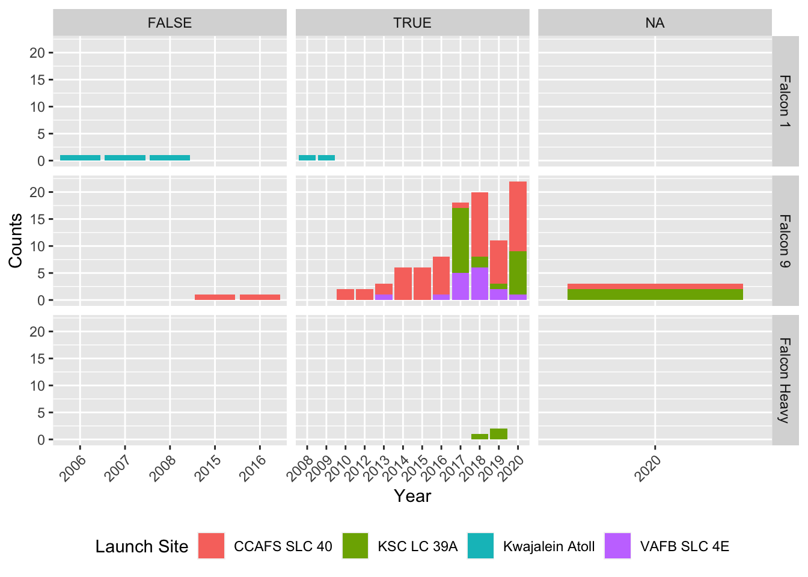

<!-- README.md is generated from README.Rmd. Please edit that file -->
SpaceX - An R API wrapper for the SpaceX project
================================================

[](http://www.repostatus.org/#active)

Installation
------------

Until now the package is not on CRAN but you can download it via GitHub with the following command:

``` r
if (!require("devtools"))
  install.packages("devtools")
devtools::install_github("JohannesFriedrich/SpaceX")
```

Introduction
------------

The **R**-package *SpaceX* is an API wrapper for data collected by <https://api.spacexdata.com/v2/>. You can request available data with different functions:

<table style="width:100%;">
<colgroup>
<col width="25%" />
<col width="64%" />
<col width="9%" />
</colgroup>
<thead>
<tr class="header">
<th>Function name</th>
<th>Description</th>
<th>Example</th>
</tr>
</thead>
<tbody>
<tr class="odd">
<td>get_SpaceX_info()</td>
<td>request common information about SpaceX</td>
<td>get_SpaceX_info()</td>
</tr>
<tr class="even">
<td>get_SpaceX_launches()</td>
<td>request launches</td>
<td>get_SpaceX_launches()</td>
</tr>
<tr class="odd">
<td>get_SpaceX_launchpads()</td>
<td>request launchpad data</td>
<td>get_SpaceX_launchpads()</td>
</tr>
<tr class="even">
<td>get_SpaceX_capsules()</td>
<td>request data about capsules</td>
<td>get_SpaceX_capsules()</td>
</tr>
<tr class="odd">
<td>get_SpaceX_rockets()</td>
<td>request data about different rockets</td>
<td>get_SpaceX_rockets()</td>
</tr>
<tr class="even">
<td>get_SpaceX_parts()</td>
<td>request data about parts of capsules or cores</td>
<td>get_SpaceX_parts(type = &quot;caps&quot;)</td>
</tr>
</tbody>
</table>

Request basic information from SpaceX API <a id="basic_information"></a>
------------------------------------------------------------------------

First we load some needed packages. The function `get_SpaceX_info()` will deliver some information about the company.

``` r
library(SpaceX)
library(ggplot2)
library(dplyr)

info <- get_SpaceX_info()
```

``` r
info
```

<table>
<thead>
<tr>
<th style="text-align:left;">
name
</th>
<th style="text-align:left;">
founder
</th>
<th style="text-align:right;">
founded
</th>
<th style="text-align:right;">
employees
</th>
<th style="text-align:right;">
vehicles
</th>
<th style="text-align:right;">
launch\_sites
</th>
<th style="text-align:right;">
test\_sites
</th>
</tr>
</thead>
<tbody>
<tr>
<td style="text-align:left;">
SpaceX
</td>
<td style="text-align:left;">
Elon Musk
</td>
<td style="text-align:right;">
2002
</td>
<td style="text-align:right;">
7000
</td>
<td style="text-align:right;">
3
</td>
<td style="text-align:right;">
3
</td>
<td style="text-align:right;">
1
</td>
</tr>
</tbody>
</table>
Play around with data
---------------------

``` r
get_SpaceX_launches() %>% 
ggplot() + 
  geom_bar(aes(launch_year, fill = launch_site$site_name)) +
  facet_grid(rocket$rocket_name~launch_success, scales = "free_x") +
  theme(legend.position = "bottom") + 
  scale_fill_discrete(name = "Launch Site") +
  labs(x = "Year", y = "Counts")
```



Now we request some data about the used rockets. This can be done with the function `get_SpaceX_rockets()`.

``` r
rockets <- get_SpaceX_rockets()
```

| id          | name         | type   | active |  stages|  boosters|  cost\_per\_launch|  success\_rate\_pct| first\_flight |
|:------------|:-------------|:-------|:-------|-------:|---------:|------------------:|-------------------:|:--------------|
| falcon1     | Falcon 1     | rocket | FALSE  |       2|         0|            6700000|                  40| 2006-03-24    |
| falcon9     | Falcon 9     | rocket | TRUE   |       2|         0|           61200000|                  94| 2010-06-04    |
| falconheavy | Falcon Heavy | rocket | TRUE   |       2|         2|           90000000|                 100| 2018-02-06    |

Related projects
----------------

-   [SpaceX](http://www.spacex.com/)
-   [SpaceX-API](https://github.com/r-spacex/SpaceX-API)
